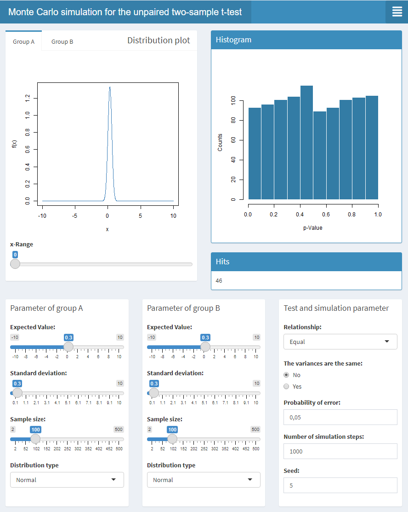
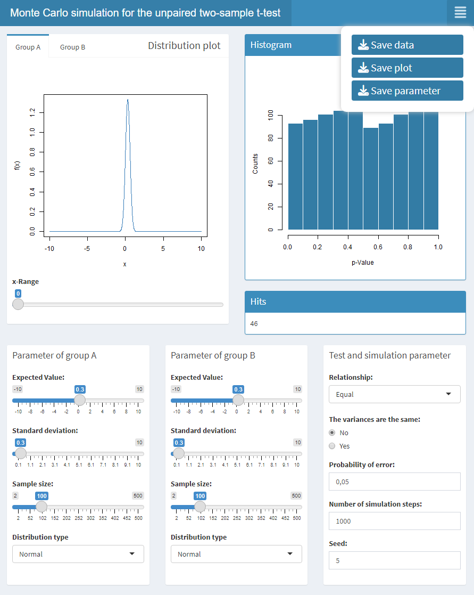

# Two sample t-test Monte Carlo simulator

This small app offers you the possibility to run the Monte Carlo 
simulation with two sample t-tests (unpaired) via a simple graphical interface.

## Description

<p float="left">
   
   
</p>

This app allows you to run the Monte Carlo simulation for the two sample 
t-test using a simple graphical interface. For each group you can change 
the parameters standard deviation, expected value, sample size and the following 
selectable distribution types:

* Normal
* Uniform
* Exponential
* Gamma
* Logistic
* Biplane (not available thus far)

Each distribution can be displayed for each group to get a small overview 
of the distribution type. You can change the known parameters of the
t-test and of course the simulation parameters like simulation steps and seed.
The simulation result is displayed as a simple histogram. If
you want to learn more about Monte Carlo simulation, 
[see here](https://tjmurphy.github.io/jabstb/ttestmc.html).
It is also possible to save your results. Just click on the 
menu in the upper right corner (three white lines). You can then save 
the following:

* Saving the simulation data (TSV)
* Saving the plot (PNG) (only the histogram!)
* Saving the parameter you used for each group and simulation (TSV)

## Getting Started

### Dependencies

It should run on both Windows 10 and Linux (only tested on Manjaro). You will need at least an R environment.                               
Besides the operating system I used the following programs and additional packages:                                                     

* Programs
   - [RStudio (2022.07.2 Build 576)](https://posit.co/download/rstudio-desktop/)
   - [R (Version 3.3.0+)](https://posit.co/download/rstudio-desktop/)

* Packages
   - [matrixTests (0.1.9.1)](https://cran.r-project.org/web/packages/matrixTests/index.html)
   - [shiny (1.7.3)](https://cran.r-project.org/web/packages/shiny/index.html)
   - [shinydashboard (0.7.2)](https://cran.r-project.org/web/packages/shinydashboard/index.html)
   - [shinyfeedback (0.4.0)](https://cran.rstudio.com/web/packages/shinyFeedback/index.html)
   - [shinyjs (2.1.0)](https://cran.r-project.org/web/packages/shinyjs/index.html)
   - [shinyWidgets (0.7.5)](https://cran.r-project.org/web/packages/shinyWidgets/index.html)

### Installing

1. Install R
2. Install RStudio

### Executing program

* How to run the program
* Step-by-step bullets
```
code blocks for commands
```

## Help

Any advise for common problems or issues.
```
command to run if program contains helper info
```

## Authors

Contributors names and contact info

ex. Dominique Pizzie  
ex. [@DomPizzie](https://twitter.com/dompizzie)

## Version History

* 0.1
    * Initial Release

## License

This project is licensed under the MIT License - see the LICENSE.md file for details

## Acknowledgments

