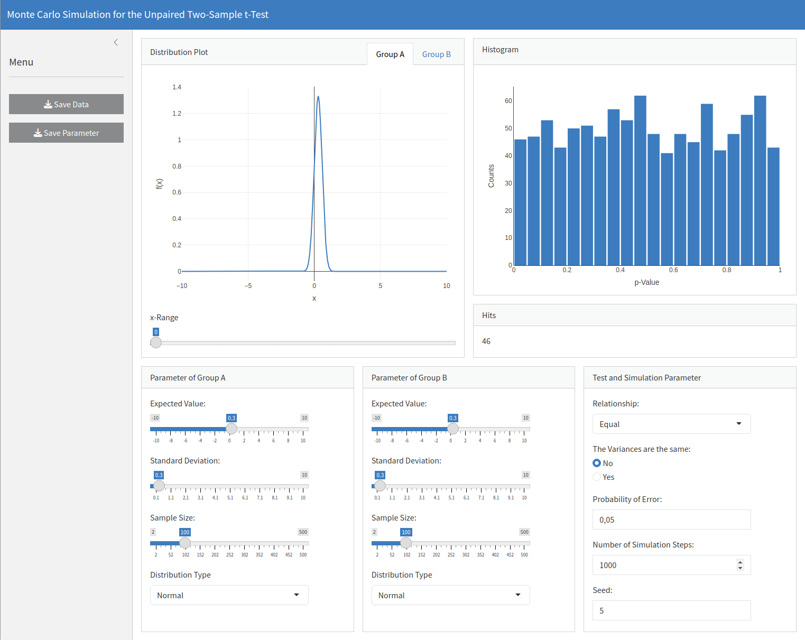

# Two sample t-test Monte Carlo simulator

This small app offers you the possibility to run the Monte Carlo 
simulation with two sample t-tests (unpaired) via a simple graphical interface.
An online version can be find [here](https://benwort-apps.shinyapps.io/Two_sample_t_test_Monte_Carlo_simulator/).

## Description

<p float="left">
   
</p>

This app allows you to run the Monte Carlo simulation for the two sample 
t-test using a simple graphical interface. For each group you can change 
the parameters standard deviation, expected value, sample size and the following 
selectable distribution types:

* Normal
* Uniform
* Exponential
* Gamma
* Logistic
* Biplane (not available thus far)

Each distribution can be displayed for each group to get a small overview 
of the distribution type. You can change the known parameters of the
t-test and of course the simulation parameters like simulation steps and seed.
The simulation result is displayed as a simple histogram. If
you want to learn more about Monte Carlo simulation, 
[see here](https://tjmurphy.github.io/jabstb/ttestmc.html).
It is also possible to save your results. Just click on the corresponding button 
in the menu on the left hand side. You can then save 
the following:

* Saving the simulation data (TSV)
* Saving the plot (Can be downloaded directly from the Plotly Interface)
* Saving the parameter you used for each group and simulation (TSV)

## Getting Started

### Dependencies

It should run on both Windows 10 and Linux (tested on Manjaro, MInt and MX Linux). You will need at least an R environment.                               
Besides the operating system I used the following programs and additional packages:                                                     

* Programs
   - [RStudio (2024.12.1 Build 563)](https://posit.co/download/rstudio-desktop/)
   - [R (4.3.3)](https://posit.co/download/rstudio-desktop/)

* Packages
   - [matrixTests (0.2.3)](https://cran.r-project.org/web/packages/matrixTests/index.html)
   - [shinyfeedback (0.4.0)](https://cran.rstudio.com/web/packages/shinyFeedback/index.html)
   - [shinyjs (2.1.0)](https://cran.r-project.org/web/packages/shinyjs/index.html)
   - [shinyWidgets (0.7.5)](https://cran.r-project.org/web/packages/shinyWidgets/index.html)
   - [bslib (0.9.0)](https://cran.r-project.org/web/packages/bslib/index.html)
   - [plotly (4.10.4)](https://cran.r-project.org/web/packages/plotly/index.html)

### Installing & Executing 

Just download the R file and run it in a shiny R environment. Nothing more is needed except the programs and 
packages I have given above.

## Help

The function '''group_parameter_server''' interrupts the simulation if you change the distribution type 
If you change the distribution type, you can stop the simulation without interruption 
However, you must make sure that all parameters are within acceptable limits before running the simulation 
When the distribution type is changed, the simulation is interrupted and the parameter input controls are also
updated with the given values to avoid any kind of erroneous calculations. The update takes some time. 
I used the '''debounce''' function to solve the problem and chose 150ms (tested with an AMD Ryzen 7 3700X) 
Eventhough this is not ideal, but I haven't found a better solution thus far. If the simulator generates NaN'S after
you have changed the distribution type, you can change the interruption time directly in the code:

```
group_parameter_server <- function(input, output, session) {
  
  ...
  
  # Interrupt the simulation 
  updateTrigger <- debounce(reactive({
    req(input$distributiontype) 
  }), 150)
 
  ...
 
  return(update_in_progress)
  
}

```
However, I am considering a solution with a simple start and stop button to avoid this kind of issue.

## License

This project is licensed under the MIT License - see the LICENSE.md file for details
